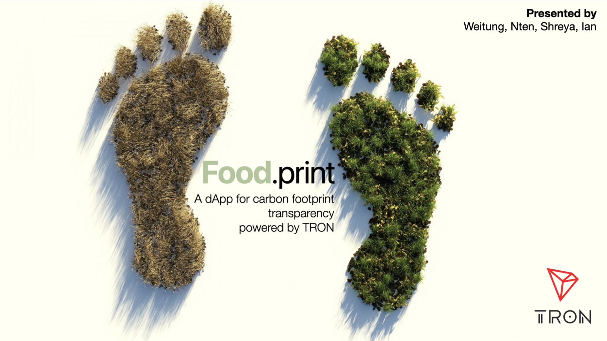

# Foodprint
## Reducing carbon emission, every time you eat
## Received Top 15 (Honorable Mentions) in TRON 2022 Web 3.0 Hackathon

## Our idea
A dAPP for tracing food carbon footprint for restaurants and individual consumers, developed on TRON.

## Foodprint starter guide
``cd dapp-foodprint ``

``yarn`` (``npm install yarn`` if not present)
